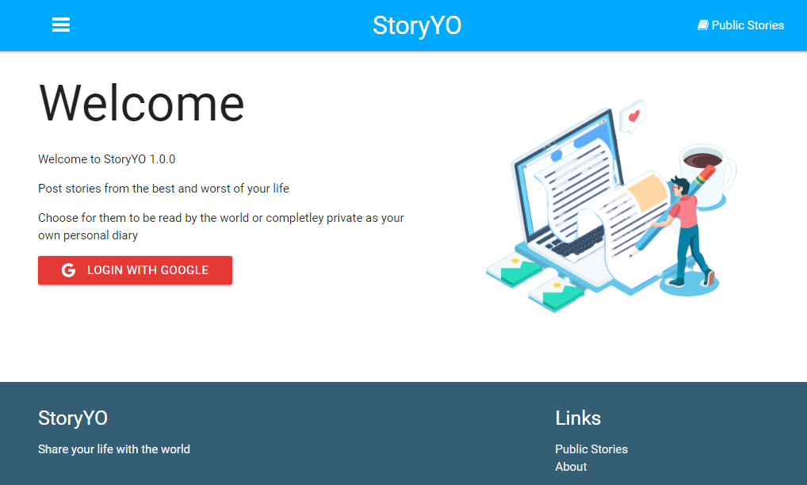
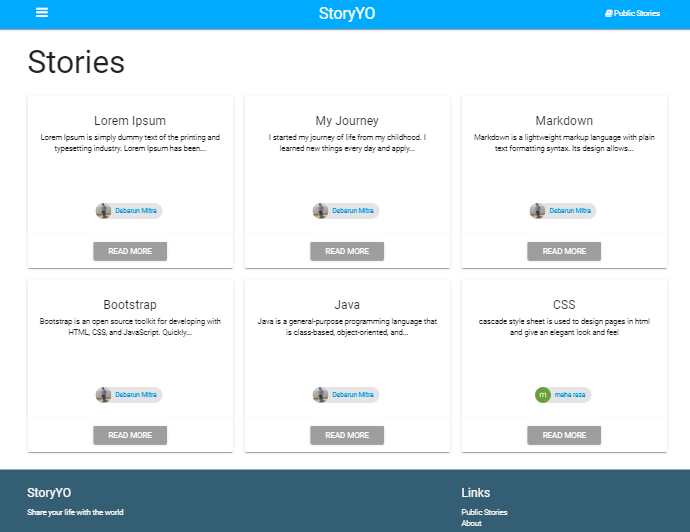
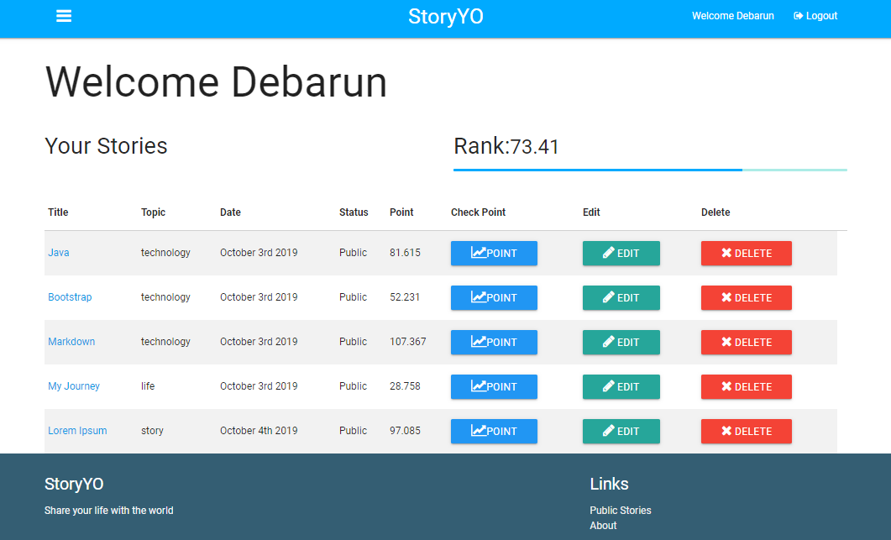
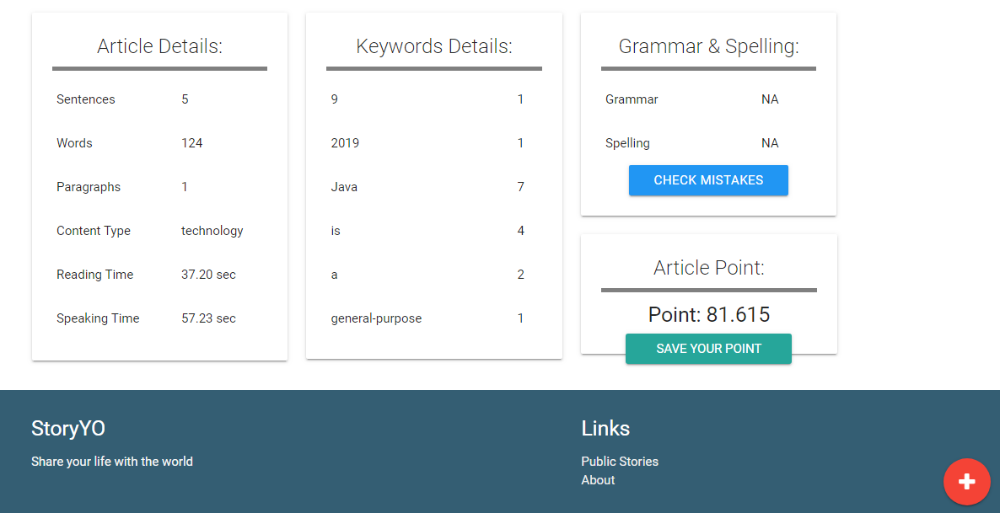
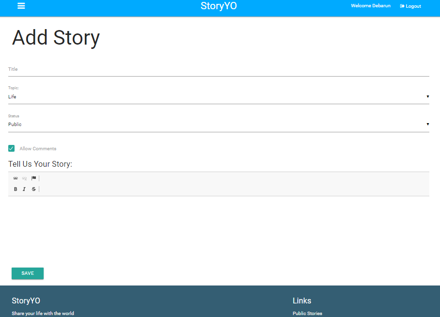

# StoryYO
An application where people can share there stories, experiences and thoughts.This application process the article based on used of words, sentences, paragraphs, spelling and grammar. After processing an article a report generated and based on that User get some rank.
## Author:
- [Debarun Mitra](https://github.com/DebarunMitra)
- [Ranjith](https://github.com/ranjithckumar)
## Application name: 
StoryYo
## Technology used: 
 - HTML
 - CSS
 - JavaScript
 - NodeJS
 - ExpressJS
 - MongoDB
## Objective: 
An application where people can share there stories, experiences and thoughts.
## Visit:
[StoryYO](https://storyyo.herokuapp.com/)
## Screenshot:

#### +++++++++++++++++++++++++++++++++++++++++++++

#### +++++++++++++++++++++++++++++++++++++++++++++

#### +++++++++++++++++++++++++++++++++++++++++++++

#### +++++++++++++++++++++++++++++++++++++++++++++

#### +++++++++++++++++++++++++++++++++++++++++++++

#### +++++++++++++++++++++++++++++++++++++++++++++

